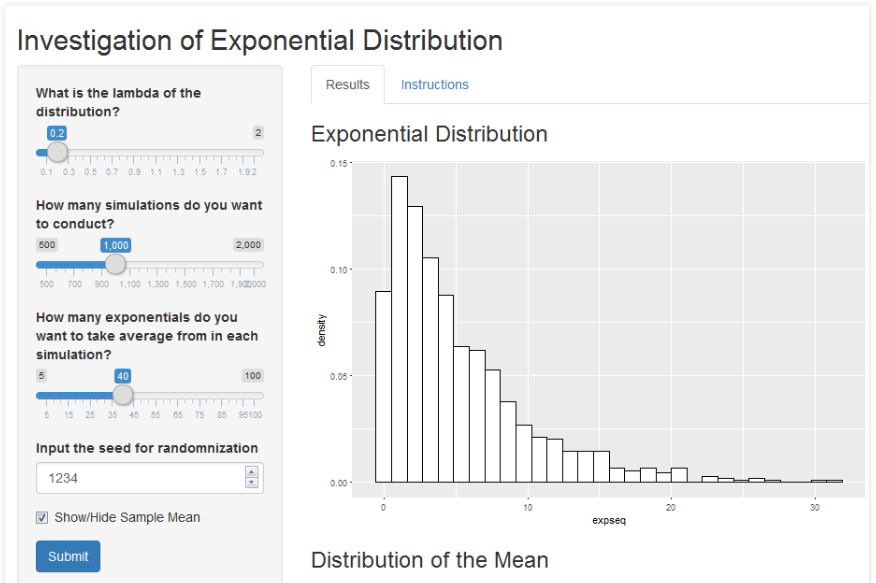

```{r setup, include=FALSE}
knitr::opts_chunk$set(cache = TRUE, echo = TRUE, message = FALSE, warning = FALSE)
```

## Goal

This presentation created as a part of the course project of the Developing Data Products course in the Data Science specialisation. 
The project consists of two parts:

* Shiny application demonstrating the investigation of exponential distribution 

The application located at: https://rozerov.shinyapps.io/Work/

* R presentation that introduces the above application (current presentation)

All related files can be found in GitHub repository: 
https://github.com/RomanDST/BuildDataProducts

## Introduction

This application based on the course project of Statistical Inference class of the Data Science specialisation.

In that project, we investigated the exponential distribution in R and compared it with the Central Limit Theorem. More specificly, we studied the distribution of 1000 averages of 40 exponentially distributed variables with lambda = 0.2.

In this application, we may change the following parameters:

* Number of simulations (up to 2000), 

* Number of exponentials we generate in each simulation (up to 100), 

* Lambda parameter (up to 2.0), 

We may also enter the seed for randomization

## Application Interface   



## Code Sample

Simplified example code of the sample mean calculation in the server:
```{r}
  set.seed(1234)
  lambda <- 0.2
  nosim <- 1000
  n <- 40
  
  mns = NULL
  for (i in 1 : nosim) mns = c(mns, mean(rexp(n,lambda)))
  sampleMean <- mean(mns)
  theoMean <- 1/lambda
  rbind(sampleMean, theoMean)
```


